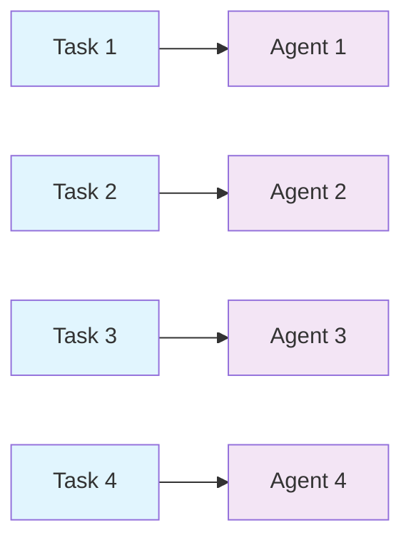

# LinearSwarm

The `LinearSwarm` class implements a simple sequential processing pattern where agents process tasks one after another in a linear order. Each agent receives one task from the task list and processes it independently. This architecture is ideal for scenarios where you have multiple independent tasks that need to be distributed across multiple agents in a straightforward, sequential manner.

## What is Linear Processing?

Linear processing is one of the simplest task distribution patterns where agents are assigned tasks in a first-come-first-served manner. Each agent processes exactly one task (if available) in the order they appear in the agent list. This pattern ensures predictable execution order and is easy to understand and debug.

## Key Characteristics

- **Sequential Assignment**: Tasks are assigned to agents in the order they appear in the agent list
- **One Task Per Agent**: Each agent processes exactly one task (if tasks are available)
- **Independent Execution**: Tasks are processed independently - no agent sees another agent's output
- **Simple and Predictable**: The execution order is deterministic and easy to reason about

## When to Use LinearSwarm

LinearSwarm is best suited for:

- **Independent Task Processing**: When you have multiple unrelated tasks that can be processed independently
- **Simple Task Distribution**: When you need a straightforward way to distribute tasks across agents
- **Predictable Execution**: When execution order matters and you want deterministic behavior
- **Resource Allocation**: When you want to ensure each agent gets exactly one task

## Architecture



## Class Attributes

| Attribute | Type | Description |
|-----------|------|-------------|
| `agents` | `AgentListType` | List of Agent objects participating in the swarm |
| `name` | `str` | Name identifier for the swarm instance (default: `"LinearSwarm"`) |
| `description` | `str` | Description of the swarm's purpose |
| `output_type` | `str` | Format for output: `"dict"`, `"list"`, `"string"`, `"json"`, `"yaml"`, `"xml"`, etc. (default: `"dict"`) |
| `conversation` | `Conversation` | Internal conversation history tracking |

## Constructor

### `__init__(agents, name, description, output_type)`

Initializes a new LinearSwarm instance.

**Parameters:**

| Parameter | Type | Default | Required | Description |
|-----------|------|---------|----------|-------------|
| `agents` | `AgentListType` | - | **Yes** | List of Agent objects or nested list of Agent objects |
| `name` | `str` | `"LinearSwarm"` | No | Name identifier for this swarm instance |
| `description` | `str` | `"A linear swarm where agents process tasks sequentially"` | No | Description of the swarm's purpose |
| `output_type` | `str` | `"dict"` | No | Output format type: `"dict"`, `"list"`, `"string"`, `"json"`, `"yaml"`, `"xml"`, etc. |

**Returns:**

| Type | Description |
|------|-------------|
| `LinearSwarm` | A new LinearSwarm instance |

**Example:**

```python
from swarms import Agent
from swarms.structs.various_alt_swarms import LinearSwarm

# Create agents
agent1 = Agent(agent_name="Agent1", model_name="gpt-4o-mini")
agent2 = Agent(agent_name="Agent2", model_name="gpt-4o-mini")
agent3 = Agent(agent_name="Agent3", model_name="gpt-4o-mini")

# Initialize LinearSwarm
swarm = LinearSwarm(
    agents=[agent1, agent2, agent3],
    name="MyLinearSwarm",
    description="Processes tasks sequentially across agents",
    output_type="dict"
)
```

## Methods

### `run(tasks)`

Executes the linear swarm with the given tasks. Each agent processes exactly one task in sequential order.

**Parameters:**

| Parameter | Type | Required | Description |
|-----------|------|----------|-------------|
| `tasks` | `List[str]` | **Yes** | List of tasks to be processed by the agents |

**Returns:**

| Type | Description |
|------|-------------|
| `Union[Dict, List, str]` | The conversation history in the requested format (dict, list, or string based on `output_type`) |

**Raises:**

| Exception | Condition |
|-----------|-----------|
| `ValueError` | If agents or tasks lists are empty |

**Execution Flow:**

1. Validates that both agents and tasks lists are not empty
2. Iterates through agents in order
3. For each agent, assigns the next available task from the task list
4. Agent processes the task independently
5. Response is added to conversation history
6. Returns formatted output based on `output_type`

**Example:**

```python
# Define tasks
tasks = [
    "Analyze the market trends for Q1",
    "Generate a sales report",
    "Review customer feedback"
]

# Run the swarm
result = swarm.run(tasks)
print(result)
```

## Usage Examples

### Example 1: Content Generation Pipeline

```python
from swarms import Agent
from swarms.structs.various_alt_swarms import LinearSwarm

# Create specialized content agents
blog_writer = Agent(
    agent_name="BlogWriter",
    agent_description="Expert blog post writer",
    system_prompt="You are an expert blog writer specializing in technology topics.",
    model_name="gpt-4o-mini",
)

social_media_writer = Agent(
    agent_name="SocialMediaWriter",
    agent_description="Social media content creator",
    system_prompt="You are a social media content creator who writes engaging posts.",
    model_name="gpt-4o-mini",
)

email_writer = Agent(
    agent_name="EmailWriter",
    agent_description="Email marketing specialist",
    system_prompt="You are an email marketing specialist who writes compelling emails.",
    model_name="gpt-4o-mini",
)

# Initialize LinearSwarm
content_swarm = LinearSwarm(
    agents=[blog_writer, social_media_writer, email_writer],
    name="ContentGenerationSwarm",
    description="Generates different types of content in parallel",
    output_type="dict"
)

# Define content tasks
content_tasks = [
    "Write a blog post about AI in healthcare",
    "Create a social media post about our new product launch",
    "Draft an email newsletter for our subscribers"
]

# Execute tasks
results = content_swarm.run(content_tasks)

# Process results
for agent_name, content in results.items():
    print(f"{agent_name}: {content}")
```

### Example 2: Data Analysis Tasks

```python
from swarms import Agent
from swarms.structs.various_alt_swarms import LinearSwarm

# Create analysis agents
financial_analyst = Agent(
    agent_name="FinancialAnalyst",
    system_prompt="You are a financial analyst expert in market analysis.",
    model_name="gpt-4o-mini",
)

market_researcher = Agent(
    agent_name="MarketResearcher",
    system_prompt="You are a market researcher specializing in consumer behavior.",
    model_name="gpt-4o-mini",
)

data_scientist = Agent(
    agent_name="DataScientist",
    system_prompt="You are a data scientist expert in statistical analysis.",
    model_name="gpt-4o-mini",
)

# Initialize swarm
analysis_swarm = LinearSwarm(
    agents=[financial_analyst, market_researcher, data_scientist],
    output_type="list"
)

# Analysis tasks
analysis_tasks = [
    "Analyze Q4 financial performance",
    "Research consumer preferences for eco-friendly products",
    "Perform statistical analysis on customer retention data"
]

# Run analysis
results = analysis_swarm.run(analysis_tasks)
print(f"Completed {len(results)} analyses")
```

### Example 3: Customer Support Responses

```python
from swarms import Agent
from swarms.structs.various_alt_swarms import LinearSwarm

# Create support agents
technical_support = Agent(
    agent_name="TechnicalSupport",
    system_prompt="You are a technical support specialist helping customers with technical issues.",
    model_name="gpt-4o-mini",
)

billing_support = Agent(
    agent_name="BillingSupport",
    system_prompt="You are a billing support specialist helping customers with payment and subscription questions.",
    model_name="gpt-4o-mini",
)

general_support = Agent(
    agent_name="GeneralSupport",
    system_prompt="You are a general support specialist helping customers with various inquiries.",
    model_name="gpt-4o-mini",
)

# Initialize support swarm
support_swarm = LinearSwarm(
    agents=[technical_support, billing_support, general_support],
    name="CustomerSupportSwarm"
)

# Customer inquiries
customer_tickets = [
    "I'm having trouble connecting to the API",
    "I need to update my payment method",
    "What are your business hours?"
]

# Process tickets
responses = support_swarm.run(customer_tickets)

# Display responses
for i, response in enumerate(responses):
    print(f"Ticket {i+1} Response: {response}")
```

## Comparison with Similar Patterns

### LinearSwarm vs SequentialWorkflow

| Feature | LinearSwarm | SequentialWorkflow |
|---------|-------------|-------------------|
| **Task Distribution** | Each agent gets one independent task | All agents work on the same task sequentially |
| **Output Sharing** | Agents don't see each other's output | Each agent receives previous agent's output |
| **Use Case** | Multiple independent tasks | Single task requiring multiple steps |
| **Execution** | Parallel-ready (independent tasks) | Strictly sequential (dependent steps) |

### LinearSwarm vs CircularSwarm

| Feature | LinearSwarm | CircularSwarm |
|---------|-------------|---------------|
| **Task Assignment** | One task per agent | All agents process all tasks |
| **Execution Pattern** | Each agent processes once | Agents cycle through all tasks |
| **Use Case** | One-time task distribution | Iterative refinement on same tasks |

## Best Practices

### 1. Task Independence
Ensure tasks are independent since agents don't share context:
```python
# ✅ Good: Independent tasks
tasks = ["Task 1", "Task 2", "Task 3"]

# ❌ Avoid: Tasks that depend on each other
tasks = ["Generate report", "Review the report", "Approve the report"]
```

### 2. Agent-Task Matching
Match agent count to expected task count for optimal resource usage:
```python
# If you have 5 tasks, use 5 agents
agents = [agent1, agent2, agent3, agent4, agent5]
tasks = ["Task 1", "Task 2", "Task 3", "Task 4", "Task 5"]
```

### 3. Error Handling
Implement error handling for individual task failures:
```python
try:
    results = swarm.run(tasks)
except ValueError as e:
    print(f"Error: {e}")
    # Handle empty agents or tasks
```

### 4. Output Format Selection
Choose appropriate output format based on your needs:
```python
# For structured data processing
swarm = LinearSwarm(agents=agents, output_type="dict")

# For simple list of results
swarm = LinearSwarm(agents=agents, output_type="list")

# For JSON API responses
swarm = LinearSwarm(agents=agents, output_type="json")
```

## Limitations

1. **No Inter-Agent Communication**: Agents work independently and don't see each other's outputs
2. **Fixed Task Assignment**: Each agent gets exactly one task (if available)
3. **No Task Prioritization**: Tasks are processed in the order they appear in the list
4. **Sequential Execution**: While tasks are independent, they're still assigned sequentially

## Use Cases Summary

| Use Case | Description | Example |
|----------|-------------|---------|
| **Content Generation** | Generate different types of content in parallel | Blog posts, social media, emails |
| **Data Analysis** | Analyze different datasets independently | Financial analysis, market research, statistics |
| **Customer Support** | Handle multiple customer inquiries | Technical support, billing, general inquiries |
| **Batch Processing** | Process multiple independent items | Image processing, document analysis, data validation |
| **Resource Distribution** | Distribute work across available agents | Task queue processing, load distribution |

## Conclusion

`LinearSwarm` provides a simple and effective way to distribute independent tasks across multiple agents. It's ideal for scenarios where you have multiple unrelated tasks that can be processed in parallel, and you want a straightforward, predictable execution pattern. While it doesn't support inter-agent communication or complex workflows, its simplicity makes it easy to understand, debug, and maintain.

For more complex scenarios requiring agent collaboration or sequential dependencies, consider using `SequentialWorkflow` or other swarm architectures like `CircularSwarm` or `StarSwarm`.

